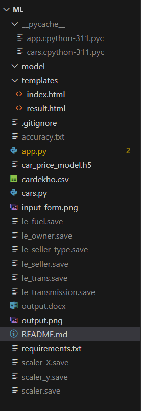
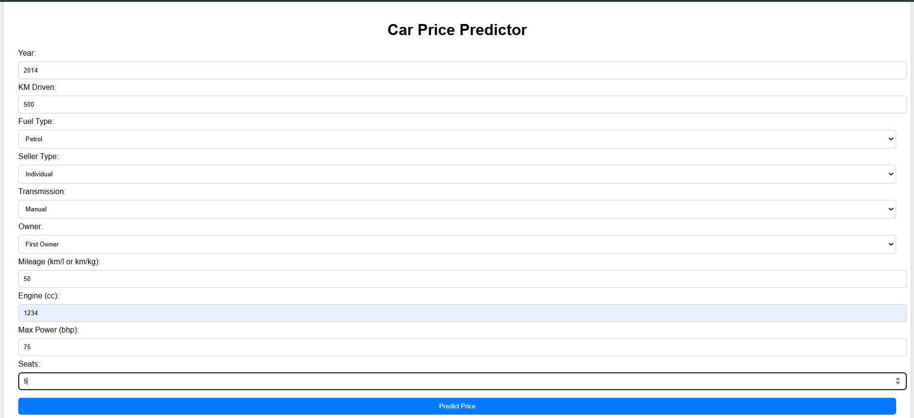
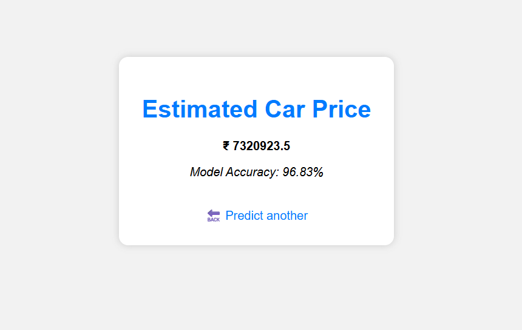

# 🚗 Car Price Prediction using Deep Learning

A deep learning-based web app that predicts the price of a used car based on various features like year, fuel type, transmission, ownership, and seller type. Built with Keras and deployed using Flask.

## 💡 Features
- Deep Learning model trained on a real-world dataset (`cardekho.csv`)
- Input features like year, fuel, seller type, owner, transmission
- Flask-based frontend to interact with the model
- Encoders and scalers stored as `.save` files for real-time inference

## 🛠️ Tech Stack
- Python
- TensorFlow / Keras
- Scikit-learn
- Flask
- HTML/CSS (Jinja2 templates)

## 📁 Project Structure

📸 Demo

👩‍💻 Author
Niharika Sreekakulapu